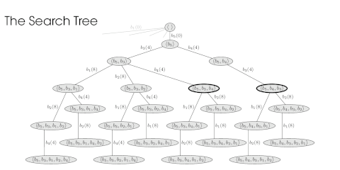

<p align="center">

</p>

Source code for our [ASPLOS 2023](https://www.asplos-conference.org/asplos2023/) paper, "***[MiniMalloc: A Lightweight Memory Allocator for Hardware-Accelerated Machine Learning](https://doi.org/10.1145/3623278.3624752)***."

## News

 * MiniMalloc to be featured in the [MIT PL Review 2025](https://plr.csail.mit.edu/) on April 25th, 2025.

## Overview

An increasing number of deep learning workloads are being supported by *hardware acceleration*.  In order to unlock the maximum performance of a hardware accelerator, a machine learning model must first be carefully mapped onto its various internal components by way of a *compiler*.  One especially important problem faced by a production-class compiler is that of *memory allocation*, whereby a set of buffers with predefined lifespans are mapped onto offsets in global memory.  Since this allocation is performed statically, the compiler has the freedom to place buffers strategically, but must nevertheless wrestle with a combinatorial explosion in the number of assignment possibilities.

**MiniMalloc** is a state-of-the-art algorithm designed specifically for static memory allocation that uses several novel search techniques in order to solve such problems efficiently and effectively.

## How it works

A key insight motivating our methodology is the discovery of a specific category of solutions -- which we call *canonical solutions* -- that correspond to the members of an algebraic lattice:

<p align="center">

</p>

By limiting our exploration to the subset of canonical solutions, we can dramatically reduce the size of the search space while simultaneously ensuring that our algorithm remains sound and complete.  We also employ a new spatial inference technique that takes advantage of this special structure, allowing our solver to backtrack much earlier than otherwise possible.  Finally, we implement a new mechanism for detecting and eliminating dominated solutions from consideration.

## Setup

```
$ git clone --recursive git@github.com:google/minimalloc.git && \
      cd minimalloc && cmake -DCMAKE_BUILD_TYPE=Release && make
```

## Example input file

```
id,lower,upper,size
b1,0,3,4
b2,3,9,4
b3,0,9,4
b4,9,21,4
b5,0,21,4
```

## Example usage

```
$ ./minimalloc --capacity=12 --input=benchmarks/examples/input.12.csv --output=output.12.csv
```

## Example output file

```
id,lower,upper,size,offset
b1,0,3,4,8
b2,3,9,4,8
b3,0,9,4,4
b4,9,21,4,4
b5,0,21,4,0
```

## Python bindings

We also provide Python bindings for MiniMalloc. You can install them with pip:

```bash
$ pip install .
```

When installed, you can use the package as follows:

```python
import minimalloc as mm
problem = mm.from_csv_file("benchmarks/examples/input.12.csv")
problem.capacity = 12
solver = mm.Solver()
solution = solver.solve(problem)
print(solution) # Solution(offsets=[8, 8, 4, 4, 0])
```

During development, you can install the package in "editable" mode with:

```bash
$ pip install -e ".[dev]"
```

and run formatters, type checkers, and tests with:

```bash
$ ruff format . && ruff check . --fix && mypy . && pytest python
```

## How to cite?

```bibtex
@inproceedings{Moffitt2023,
  title = {{MiniMalloc}: A Lightweight Memory Allocator for Hardware-Accelerated Machine Learning},
  booktitle = {Proceedings of the 28th International Conference on Architectural Support for Programming Languages and Operating Systems},
  volume = {4},
  pages = {238--252},
  author = {Moffitt, Michael D.},
  year = {2023},
  series = {ASPLOS 2023},
  url = {https://doi.org/10.1145/3623278.3624752},
  doi = {10.1145/3623278.3624752}
}
```

## Disclaimer

This is not an officially supported Google product.
